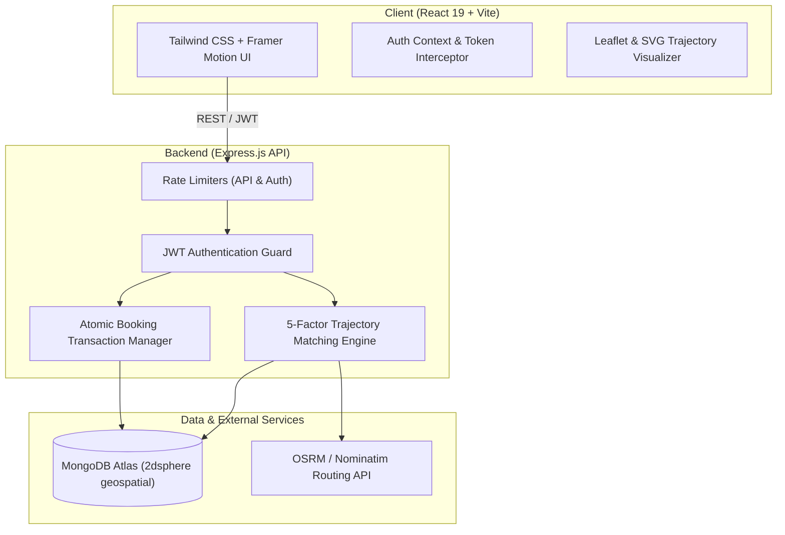

# 🚀 SmartRoute — Peer-to-Peer Route & Fuel Cost Sharing Platform

[](https://opensource.org/licenses/MIT)
[](https://nodejs.org/)
[](https://react.dev/)
[](https://www.mongodb.com/)
[](https://tailwindcss.com/)

> **SmartRoute is NOT a taxi or commercial ride-hailing application.**  
> It is an algorithmic peer-to-peer route compatibility and shared commute platform. A driver already traveling along their personal commute shares vacant seats with a verified co-commuter heading in the same direction, strictly splitting fuel expenses according to real vehicle mileage.

---

## 📑 Table of Contents

- [Core Principles & Architectural Philosophy](#-core-principles--architectural-philosophy)
- [System Architecture & Data Flow](#-system-architecture--data-flow)
- [Key Features](#-key-features)
- [5-Factor Geometric Route Matching Engine](#-5-factor-geometric-route-matching-engine)
- [Tech Stack](#-tech-stack)
- [Project Directory Structure](#-project-directory-structure)
- [API Reference](#-api-reference)
- [Security & Production Hardening](#-security--production-hardening)
- [Local Installation & Setup](#-local-installation--setup)
- [Environment Configuration](#-environment-configuration)
- [Production Deployment Guide](#-production-deployment-guide)
- [Contributing & License](#-contributing--license)

---

## 💡 Core Principles & Architectural Philosophy

SmartRoute solves the daily suburban and urban commuting problem with these tenets:
1. **Zero Commercial Markups**: Contributions reflect actual fuel consumed (Distance / Mileage × Current Fuel Price / Shared Seats), preventing unlicensed commercial taxi operation.
2. **Deterministic Route Compatibility**: Matches are derived through spatial-temporal overlap, pickup proximity, destination alignment, and schedule windows.
3. **Institutional Trust Networks**: Campus students (.edu / college ID) and corporate employees (corporate email / employee badge) form verified trust rings to maximize commuter safety.
4. **Atomic Concurrency Guarantee**: Seat allocation utilizes atomic MongoDB conditions (`$inc` and `$gte`) to eliminate race-condition overbooking.

---

## 🏛 System Architecture & Data Flow



---

## ✨ Key Features

### 1. 🔍 Find a Shared Route (`/find-route`)
- Search by origin, destination, vehicle category (🏍️ Motorcycle vs 🚗 Car), and max fuel budget.
- Real-time route listing connected to Backend REST API.
- Instant seat request flow with host confirmation notices.

### 2. 🚗 Offer Available Seats (`/offer-route`)
- Publish an already planned personal journey with vehicle details and available seats.
- Configure departure time and recurring commute schedules (e.g., Monday–Friday).
- Transparent fuel cost contribution calculations based on vehicle mileage.

### 3. 🎯 5-Factor Smart Route Matching (`/smart-matches`)
- Real-time comparison between host journey and passenger route.
- Interactive SVG radial score gauge and coordinate trajectory visualizer.
- Backend-driven mathematical breakdown of fuel savings vs. commercial cabs.

### 4. 🔐 Multi-Category Verification System
- **🎓 Student**: College ID card verification and campus affiliation.
- **👨‍💼 Corporate Employee**: Corporate email domain and employee badge verification.
- **👤 General Commuter**: Mobile OTP and photo identity verification.
- Verified status persists in MongoDB and renders dynamic badges across search results.

### 5. 📊 Mobility Analytics & Dashboard (`/dashboard`, `/admin`)
- Tracks shared commute mileage, fuel costs saved, and estimated CO₂ footprint reduction.
- System metrics and audit telemetry for platform admins.

---

## 🧠 5-Factor Geometric Route Matching Engine

Every potential commute match is scored from 0% to 100% using a deterministic multi-variable algorithm:

$$\text{Match Score} = 0.40(S_{\text{overlap}}) + 0.20(S_{\text{time}}) + 0.15(S_{\text{pickup}}) + 0.15(S_{\text{dest}}) + 0.10(S_{\text{reliability}})$$

| Factor | Weight | Evaluation Method |
|---|---|---|
| **Trajectory Overlap** | **40%** | Measures spatial alignment and shared corridor distance between host route and commuter route. |
| **Schedule Compatibility** | **20%** | Computes departure time difference: 100% if $\le 10$ min; linearly scales down to 0% at $\ge 60$ min. |
| **Pickup Proximity** | **15%** | Evaluates walking/detour distance from passenger pickup to driver origin via Haversine formula. |
| **Destination Proximity**| **15%** | Evaluates distance between passenger dropoff and driver destination point. |
| **Commuter Trust Tier** | **10%** | Evaluates user verification status (Student ID / Corporate Badge) and past commute reliability. |

---

## 🛠 Technology Stack

### Frontend
- **Framework**: React 19 + Vite 8
- **Styling**: Tailwind CSS v4 + Lucide Icons
- **Motion & Visuals**: Framer Motion, Leaflet GIS, Canvas SVG Gauges
- **State & Routing**: React Router v7, React Hot Toast, Axios HTTP Client

### Backend
- **Runtime**: Node.js v18+ & Express.js
- **Realtime**: Socket.IO
- **Database Driver**: Mongoose ODM with Geospatial indexing
- **Security**: Helmet, Express Rate Limit, CORS with environment whitelist, Bcrypt.js, JsonWebToken

---

## 📁 Project Directory Structure

```text
radipo/
├── client/
│   ├── src/
│   │   ├── components/      # Navbar, Footer, RouteVisualizer, Badges
│   │   ├── context/         # AuthContext with persistent tokens
│   │   ├── pages/           # FindRoute, OfferRoute, SmartMatches, Dashboard, Admin
│   │   ├── utils/           # Axios API instance with 401 interceptors
│   │   ├── App.jsx          # Route registration & protected route wrappers
│   │   └── main.jsx         # Vite entry point
│   ├── .env.example         # Client environment variables blueprint
│   ├── tailwind.config.js   # Custom SmartRoute color tokens & animations
│   ├── vite.config.js       # Vite build & proxy configuration
│   └── package.json
├── server/
│   ├── src/
│   │   ├── config/          # Database connection & env validation
│   │   ├── controllers/     # Auth, Ride, Booking, and User business logic
│   │   ├── middleware/      # JWT auth guard, error handling, rate limiting
│   │   ├── models/          # User, Ride, and Booking Mongoose schemas
│   │   ├── routes/          # REST API endpoints
│   │   └── server.js        # Express application entry point & Socket.IO server
│   ├── .env.example         # Server environment variables blueprint
│   └── package.json
├── .gitignore               # Root ignore rules for node_modules & secrets
└── README.md
```

---

## 📡 API Reference

### Health Check
- `GET /api/health` — Returns `{ status: 'ok', service: 'SmartRoute API', timestamp, uptime }`

### Authentication (`/api/auth`)
- `POST /api/auth/register` — Register a new commuter with verification category.
- `POST /api/auth/login` — Authenticate commuter and receive JWT token.
- `GET /api/auth/me` — Fetch currently authenticated commuter profile.

### Shared Routes (`/api/rides`)
- `GET /api/rides` — Search active routes by origin, destination, and vehicle type.
- `POST /api/rides` — Offer a new route (Protected).
- `POST /api/rides/calculate-cost` — Authoritative backend calculation for distance, fuel contribution, and 5-factor match score.
- `GET /api/rides/:id` — Retrieve detailed route information.

### Bookings (`/api/bookings`)
- `POST /api/bookings` — Atomically book an available seat on a route (Protected).
- `GET /api/bookings/my-bookings` — List user's booked shared commutes (Protected).
- `PATCH /api/bookings/:id/status` — Confirm or cancel a booking (Protected).

---

## 🔒 Security & Production Hardening

- **No Secrets in Source**: `.env` and sensitive files are strictly excluded via `.gitignore`.
- **Brute-Force & DoS Protection**: Express rate limiting on all endpoints with strict thresholds on `/api/auth/*`.
- **Atomic Concurrency Control**: Prevents double-booking via `Ride.findOneAndUpdate({ _id: rideId, availableSeats: { $gte: 1 } }, { $inc: { availableSeats: -1 } })`.
- **CORS Whitelist**: Strictly validates request origin against `CORS_ORIGIN` and `CLIENT_URL` environment variables.
- **Graceful Fault Tolerance**: Catches unhandled rejections and signals (`SIGTERM`, `SIGINT`) to close database pools safely.

---

## 💻 Local Installation & Setup

### Prerequisites
- Node.js 18.x or later
- npm 9.x or later
- MongoDB Atlas account (or local MongoDB running on `mongodb://127.0.0.1:27017`)

### 1. Clone the Repository
```bash
git clone https://github.com/your-username/smartroute.git
cd smartroute
```

### 2. Configure Backend
```bash
cd server
cp .env.example .env
npm install
```
Edit `server/.env` with your actual MongoDB URI and JWT Secret:
```env
PORT=5000
NODE_ENV=development
MONGO_URI=mongodb+srv://<user>:<password>@cluster0.mongodb.net/smartroute?retryWrites=true&w=majority
JWT_SECRET=your_super_secret_jwt_key
CORS_ORIGIN=http://localhost:5173
CLIENT_URL=http://localhost:5173
```

### 3. Configure Frontend
```bash
cd ../client
cp .env.example .env
npm install
```
Edit `client/.env`:
```env
VITE_API_URL=http://localhost:5000/api
VITE_SOCKET_URL=http://localhost:5000
```

### 4. Run Locally
**Terminal 1 (Backend):**
```bash
cd server
npm start
```

**Terminal 2 (Frontend):**
```bash
cd client
npm run dev
```

Visit `http://localhost:5173` to explore SmartRoute!

---

## 🌐 Production Deployment Guide

### Deploying the Backend (Render / Railway / Fly.io)
1. Link your GitHub repository.
2. Set Root Directory to `server`.
3. Set Build Command to `npm install`.
4. Set Start Command to `npm start`.
5. Set Environment Variables in dashboard:
   - `NODE_ENV=production`
   - `PORT=5000`
   - `MONGO_URI=<your-mongodb-atlas-uri>`
   - `JWT_SECRET=<strong-random-secret>`
   - `CORS_ORIGIN=https://your-frontend-domain.com`
   - `CLIENT_URL=https://your-frontend-domain.com`

### Deploying the Frontend (Vercel / Netlify)
1. Link your GitHub repository.
2. Set Root Directory to `client`.
3. Set Build Command to `npm run build`.
4. Set Output Directory to `dist`.
5. Set Environment Variables:
   - `VITE_API_URL=https://your-backend-domain.com/api`
   - `VITE_SOCKET_URL=https://your-backend-domain.com`

---

## 📄 License
This project is licensed under the MIT License — see the [LICENSE](LICENSE) file for details.
